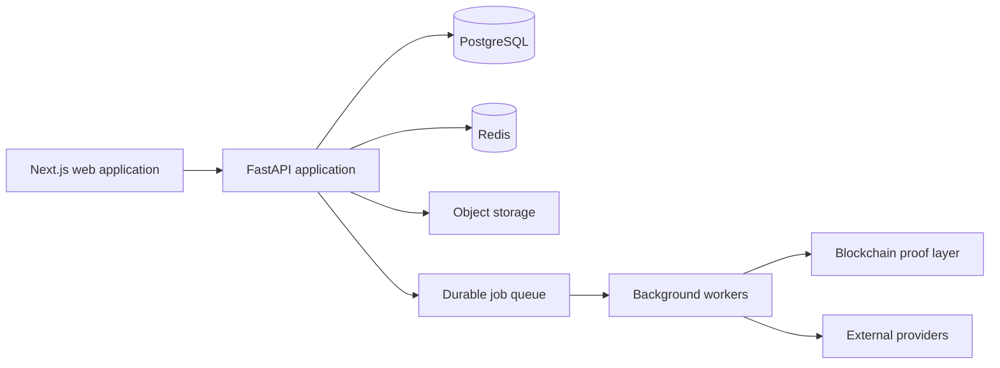

# TMI Certificate Platform

[](https://github.com/phuongdao03/TMI_blockchain_project/actions/workflows/delivery.yml)
[](https://github.com/phuongdao03/TMI_blockchain_project/actions/workflows/contract-release.yml)

TMI Certificate is a digital-asset registration and certificate platform for
submitting evidence, conducting controlled reviews, issuing verifiable
certificates and independently checking document integrity.

The platform uses blockchain as an immutable proof layer. Private documents,
personal data and operational records remain in access-controlled application
storage.

## Capabilities

- Public asset discovery and certificate verification.
- Applicant dossier creation, evidence submission and progress tracking.
- Reviewer and council workflows with conflict-of-interest controls.
- Internal account provisioning through invitations and enforced MFA.
- Payment checkout, webhook verification and reconciliation.
- Versioned certificates, revocation and exact document-hash verification.
- Auditable operations, durable background jobs and recovery tooling.

## Architecture



| Area              | Technology                            | Responsibility                                         |
| ----------------- | ------------------------------------- | ------------------------------------------------------ |
| `frontend/`       | Next.js, React, TypeScript            | Public, applicant and operations experiences           |
| `backend/`        | FastAPI, SQLAlchemy, Celery           | API, authorization, workflows and workers              |
| `contracts/`      | Solidity, Foundry                     | Certificate and document-proof commitments             |
| `infrastructure/` | Docker Compose, Nginx, GitHub Actions | Local stack, delivery, rollback and operational checks |

The browser communicates only with the backend API. Database, provider and
blockchain access are enforced behind backend service boundaries.

Admin P0 permissions, API contracts, deployment, rollback, and verification
evidence are recorded in [the admin dashboard handoff](docs/handoffs/admin-dashboard-p0.md).

## Local development

### Requirements

- Node.js `24.18.0`
- npm `11.16.0`
- Python `3.12.13`
- Docker Engine with Compose

Install the pinned root tooling and create a local environment file:

```powershell
npm ci
Copy-Item .env.example .env
```

Start the complete local stack on Windows:

```powershell
npm run local:bootstrap
```

The application is available at:

- Web: `http://localhost:3000`
- API readiness: `http://localhost:8000/ready`
- Mail preview: `http://localhost:8025`

Run the end-to-end local smoke check or stop the stack:

```powershell
npm run local:smoke
npm run local:down
```

## Quality gates

```powershell
npm run format:check
npm run lint
npm run typecheck
npm test
npm run gate:document-proof
```

Delivery workflows additionally enforce secret scanning, migrations, browser
journeys, container builds and immutable release artifacts.

## Configuration and security

- Copy `.env.example` only for local development.
- Use environment-scoped secret management for staging and production.
- Enable automatic staging deployment only after provisioning the protected
  `staging` environment and setting `STAGING_DEPLOY_ENABLED=true`.
- Never commit `.env` files, private keys, provider credentials, service-account
  files, certificates or generated evidence.
- Production configuration fails closed when encryption, MFA, payment or human
  blockchain-signer requirements are absent.

Report suspected vulnerabilities through a private GitHub Security Advisory. Do
not disclose security issues in public discussions or issues.

## Project status

The repository is under active development. Local and automated quality gates
are available; production deployment requires separately approved provider,
infrastructure and operational-readiness evidence.
